# beatles-lyrics-analysis

## Background

Ahead of the 60th anniversary of the Beatles debut album Please Please Me being released, Company A has been commissioned by a media agency to do an analysis of the lyrics of the Beatles song catalogue. To add even more excitement 5 previously unreleased songs have been discovered and will be available for fans to listen to for the first time.

They are particularly interested in the themes of the Beatles songs, and if they can be grouped together into clusters of songs. They believe this will be important so they can quickly discover what other songs the new songs should be compared to - whether it be peace, love, or any other topic.

As the media agency does some kind of celebration every few years, they have already collected all the lyrics for me and supplied them as text files. A quick look indicates that there may be duplicates in the files where there are additional live recordings that have the same lyrics, and that some files might have weird or missing data - the media company has mentioned that if anything looks amiss then it should be removed.

The media company can be very fussy, so they expect to see a small powerpoint deck outlining the results, and justifications and explanations of any methodology that is used.

## Data

- 279 files in a “lyrics” folder that are original lyrics by the Beatles to be analysed
- 5 files in a “new lyrics” folder, that are new songs by the Beatles soon to be released

## Data Extraction
Folder with txt files -> A DataFrame with columns of songs names and lyrics

    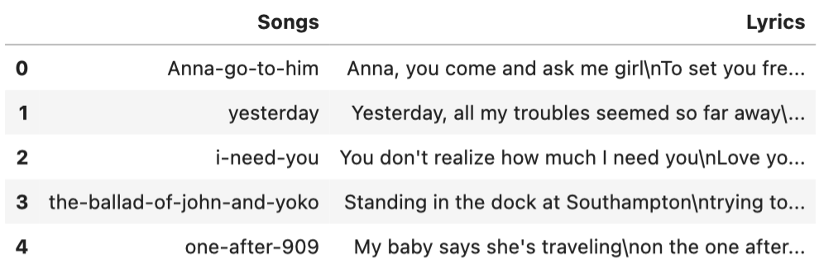

 

## Data Cleaning
- Removed blank files and songs with duplicated lyrics.
- Number of songs before cleaning: 279
- Number of songs after cleaning: 217
- Number of blank files: 58
- Number of duplicated songs: 4 
- Total number of songs removed: 62

## Exploratory Data Analysis (EDA)

### How many of the songs feature at least one pair of lines that rhyme?
- **Define rhyme:** the last words in the consecutive two lines of lyrics are ending with the same 2 letters.
- **Method:** For each song’s lyrics, split into lines and extract the last words from every two consecutive lines and check whether the two letters in the last words match.
- **Data preprocessing:** Lowercase the lyrics.
- Number of songs with at least one pair of rhyming lines: 199

    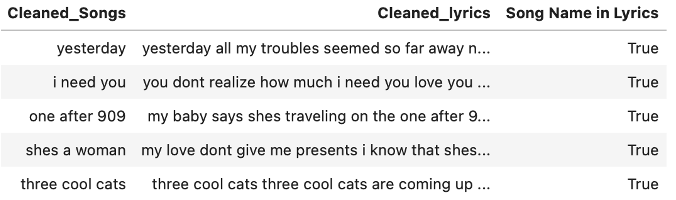

### How many of the songs feature the song name (found in the file name) in the song lyrics?
- **Method:** For each song, search in its lyrics whether the song name is in it.
- **Data Preprocessing:** The dash in song names are replaced with space. The lyrics are lowercased, removed whitespace, and punctuations.
- Number of songs that feature the song name in the lyrics: 186

#### Sentiment Analysis
- **Method:** Used SentimentIntensityAnalyzer to score the lyrics and classify them as “Negative”, “Neutral”, or “Positive” (using +-0.05 thresholds).
- **Data Preprocessing:** Further cleaned lyrics by tokenizing and removing stopwords.

    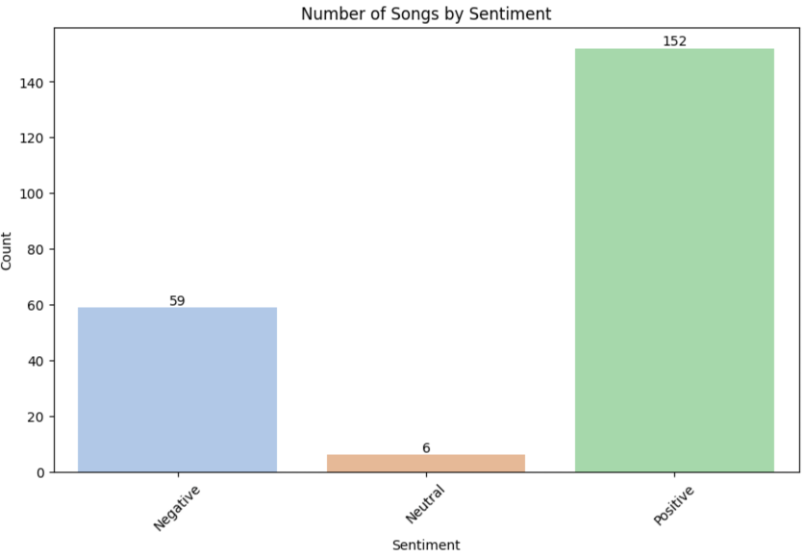

    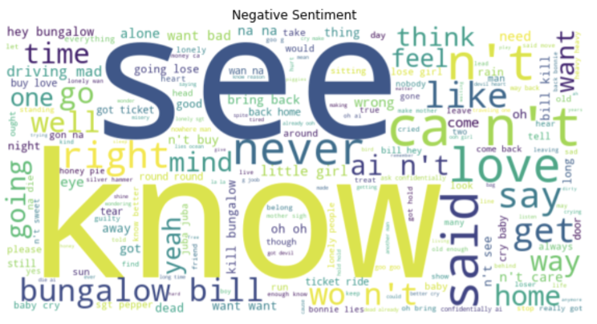

    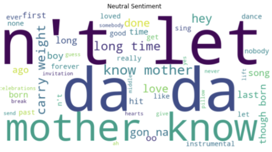

    

### Topic Clustering
**Method:** Latent Dirichlet Allocation (LDA) topic modeling Data Preprocessing:
- Lemmatization
- Create a dictionary representation of the documents
- Convert the tokenized documents into a Document-Term Matrix (DTM)

Number of topics: 5 (according to the Perplexity and Coherence scores)

### Choose number of topics
Lower perplexity values indicate a better fit to the data. Higher coherence scores indicate that the topics are more interpretable and coherent. In our case, 5 or 6 seems suitable.
- 5 topics: It has a relatively low perplexity score and a good coherence score.
- 6 topics: It has a slightly higher perplexity score but the highest coherence score, indicating more interpretable topics.

    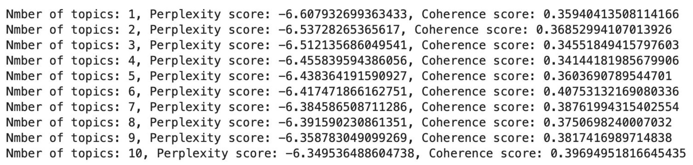

    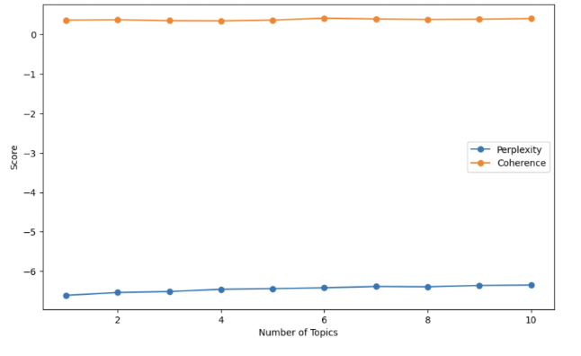

### Interpretation of Clusters

    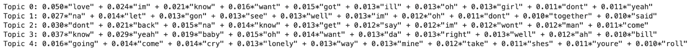

**Topic 1: Love and Affection**

This topic seems to revolve around themes of love and affection. Words like "love," "im," "know," "want," "got," and "girl" suggest a strong emphasis on love and romantic relationships. It conveys feelings of desire and affection.

**Topic 2: Actions and Expressions**

This topic appears to be about actions and expressions. Words like "na," "let," "gon," "see," and "together" suggest a focus on taking action and expressing oneself. It might involve planning or making decisions.

**Topic 3: Assertiveness and Statements**

This topic seems to involve assertiveness and statements. Words like "dont," "back," "na," "get," "say," and "wont" indicate a tone of making statements or expressing one's perspective with confidence.

**Topic 4: Positive Emotions and Affirmations**

This topic is related to positive emotions and affirmations. Words like "know," "yeah," "baby," "oh," and "want" indicate a positive and enthusiastic tone. It might involve expressions of joy, affirmation, or optimism.

**Topic 5: Emotions and Expression**

This topic could be about emotions and expressions. Words like "going," "come," "cry," "lonely," and "mine" suggest a focus on emotions and expressions, possibly related to personal experiences and feelings.

    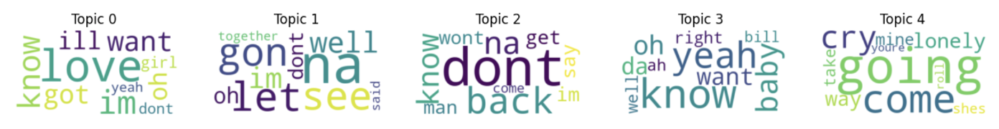

    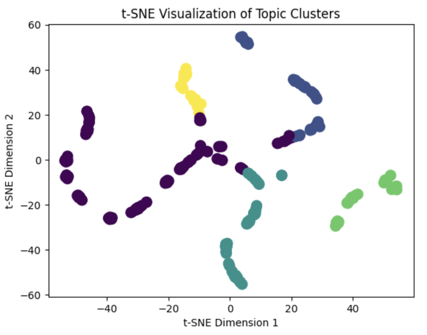

### Result

    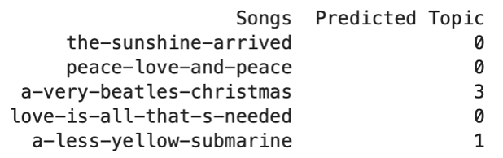

- Topic 0: Love and Affection
- Topic 1: Actions and Expressions
- Topic 2: Assertiveness and Statements 
- Topic 3: Positive Emotions and Affirmations 
- Topic 4: Emotions and Expression

    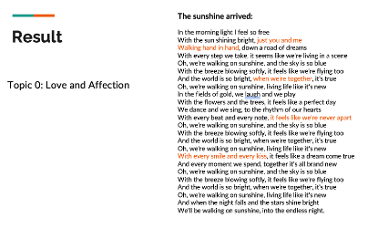

    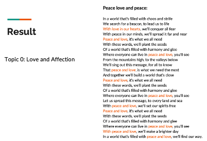

    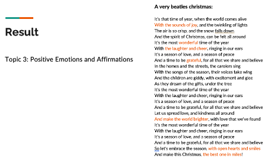

    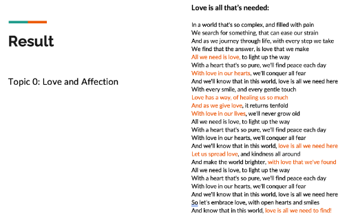

    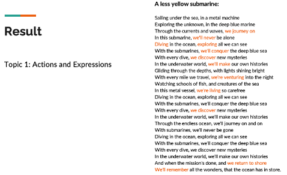

### Limitations
- Fixed number of topics
- Bag of words
- Lack of Sufficient Data
- Limited Vocabulary
- Unstable Results
- Difficulty in Interpreting Topics

### Future Work
- Hyperparameter tuning
- Exploring alternative topic modeling techniques that may be more suitable for small datasets
- Combine LDA with other clustering methods
